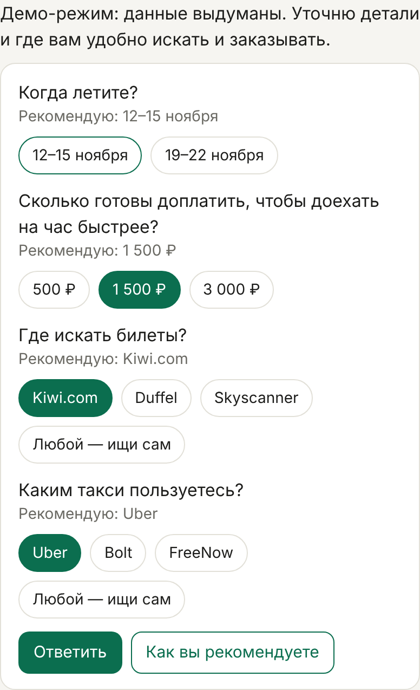
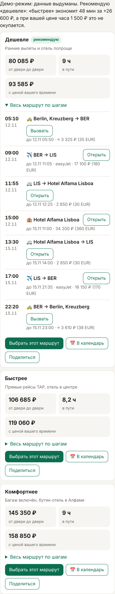
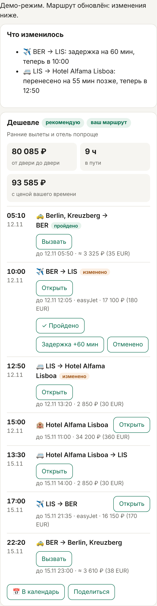
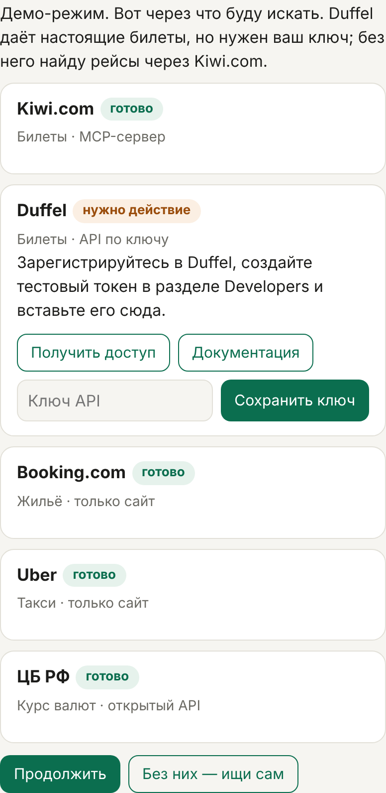
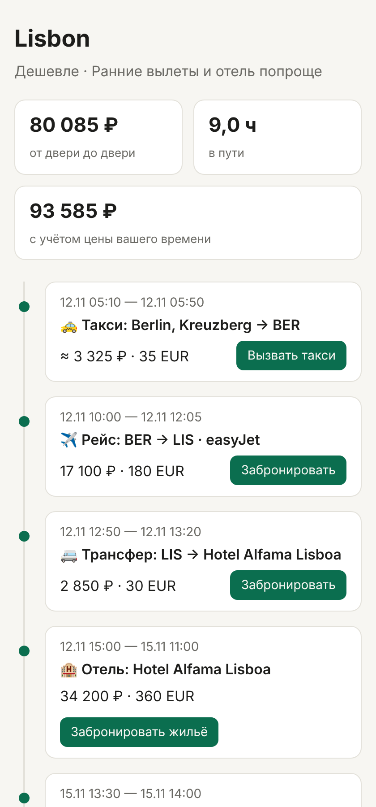

# Поездка от двери до двери

Агент, который планирует не билет, а всю дорогу. Такси от дома, рейс или поезд, трансфер, жильё и обратно — каждый шаг по времени, с итогом в рублях и ссылками для бронирования. Потом сопровождает в пути: задержали рейс — сдвигает трансфер или переключает на запасной вариант.

<p>



</p>

## Чем отличается

- **Вся дорога, а не билет.** Рейс в 06:25 — значит такси в 02:40, а заселение с 15:00 — значит багаж на стойке. Агент собирает цепочку от двери до двери и проверяет каждую стыковку.
- **Полная цена и цена времени.** Итог включает такси, трансферы и жильё. Агент спрашивает, сколько стоит ваш час, и объясняет выбор: «быстрее на 48 мин за +26 600 ₽ — при вашей цене часа это не окупается».
- **Любые сервисы.** Пользователь сам выбирает, где искать билеты и чем заказывать такси. Агент выясняет, как к сервису подключиться, говорит, чего не хватает, и даёт ссылки. Без сервиса ищет сам.
- **Арифметику считает скрипт, а не модель.** Курс ЦБ, итоги, запасы времени (3 ч до международного рейса, выход из аэропорта, +20% к такси), бюджет и даты проверяет код. Отдельный агент-судья проверяет то, что коду не видно.
- **План Б заранее.** Для рискованной стыковки рейс/поезд → рейс/поезд готов следующий вариант.
- **Сопровождение в пути**, календарь с напоминаниями и страница маршрута для попутчиков.
- Ещё: гибкие даты (самый выгодный сдвиг ± N дней), встреча группы из разных городов в одном отеле, поездка по фото или ссылке на место.

## Показать за две минуты

```sh
python3 -m system.server --demo     # → http://127.0.0.1:8000
```

1. Напишите: «Из Берлина в Лиссабон вдвоём на 3 ночи в ноябре, до 150 000 ₽».
2. Ответьте на вопросы кнопками — рекомендованный ответ выделен.
3. В «Подключениях» видно, какие сервисы готовы и что нужно для остальных; нажмите «Продолжить».
4. Сравните три маршрута, раскройте шаги, выберите «Дешевле».
5. Отметьте такси «Пройдено», затем «Задержка +60 мин» у рейса — трансфер сдвинется сам.
6. «В календарь» скачает `.ics` с напоминаниями, «Поделиться» откроет страницу маршрута.

<p>


</p>

Демо-режим идёт по тому же договору, что и настоящий агент, но на выдуманных данных (это написано на странице) — без сети и без затрат. События в нём обрабатывает настоящий скрипт.

## Запуск

Нужен Python 3.11+, зависимостей нет. Для настоящего агента — [Claude Code](https://claude.com/claude-code) с выполненным входом и доступ в интернет.

```sh
python3 -m system.server            # настоящий агент
python3 -m system.server --demo     # демо
# параметры: --port 8000, --runtime runtime (рабочая папка: данные, поездки)
```

Ход агента стоит примерно $0,1–1,3 и занимает от 15 секунд до 2 минут: дороже всего ход, где ищутся и проверяются маршруты.

## Как устроено

```
Пользователь ⇄ веб-страница ⇄ system/  (API, профиль, сервисы, ключи)
                                  │  claude -p <запрос> --json-schema <договор> --resume <сессия>
                                  ▼
                    Claude Code + skills/trip-planner  →  один JSON за ход
                       ├─ исполнители: перелёты · жильё · поезда · трансферы
                       ├─ scripts/trip.py: рубли, итоги, стыковки, календарь, страница
                       └─ судья
```

- **Ядро** — скилл `skills/trip-planner` для Claude Code. Главный агент ведёт диалог и раздаёт поиск исполнителям, скрипт проверяет и считает, судья принимает результат.
- **Система** — `system/`: одна сессия Claude Code на разговор, профиль пользователя, его сервисы и ключи, страница.

Шаги агента:

| Шаг | Ответ |
|---|---|
| Подключения: какими сервисами искать и что для них нужно | `setup` |
| Бриф: недостающие решения пользователя; без направления — куда поехать | `questions`, `options` |
| Поиск, сборка трёх маршрутов, проверка скриптом и судьёй | `itinerary` |
| В пути: событие или сообщение «рейс задержали» | `update` |
| Под бриф не подходит ни один вариант | `error` |

Договор между системой и агентом — JSON-схемы в [`skills/trip-planner/schema/`](skills/trip-planner/schema/). Шаг маршрута выглядит так:

```json
{
  "id": "s2", "type": "flight", "from": "BER", "to": "LIS",
  "start": "2026-11-12T09:00:00+01:00", "end": "2026-11-12T11:05:00+00:00",
  "carrier": "easyJet", "international": true,
  "price": { "amount": 180, "currency": "EUR", "rub": 17100, "checked_at": "…" },
  "link": "https://…", "status": "planned"
}
```

## Сервисы и ключи

Сервисы пользователь добавляет в панели «Мои сервисы» или называет в чате. Доступ бывает четырёх видов: MCP-сервер, открытый API, API по ключу и «только сайт». Каталог известных сервисов — [`providers.md`](skills/trip-planner/providers.md).

Ключ API вводится в форму, а не в чат. Система хранит ключи отдельно (`runtime/data/secrets/`, права 600) и передаёт агенту только как переменную окружения процесса (`PROVIDER_<ИМЯ>_KEY`): в переписке, запросах и ответах ключа нет. MCP-серверы пользователя подключаются к агенту автоматически.

## API системы

| Запрос | Что делает |
|---|---|
| `POST /api/start` `{user}` | новый разговор |
| `POST /api/message` `{conversation, text, attachments?}` | сообщение → ответ агента |
| `POST /api/choose` `{conversation, variant}` | выбрать маршрут: дальше поездка считается начатой |
| `POST /api/event` `{conversation, event}` | событие поездки: `step_done`, `delay`, `cancelled` |
| `POST /api/providers` `{conversation, providers?}` | сервисы пользователя; с `providers` — заменить список |
| `POST /api/key` `{conversation, env, key}` | сохранить ключ сервиса |
| `GET /files/…` | календари и страницы маршрутов |

Подробнее о вызове агента и обработке ответов — [`docs/system.md`](docs/system.md).

## Структура

```
skills/trip-planner/   агент — скилл Claude Code
  SKILL.md             шаги главного агента
  workers/             исполнители и судья
  scripts/trip.py      проверка, расчёты, события, календарь, страница
  schema/              договор с системой
  rules.json           запасы времени, пороги, напоминания, партнёрские ссылки
  providers.md         каталог сервисов
system/                система: API, страница, хранение, демо-режим
docs/                  как система вызывает агента; исследование сервисов; скриншоты
SYSTEM_PLAN.md         решения и этапы
```

Скилл можно поставить отдельно: `npx skills add https://github.com/all0b0y/search_travel --skill trip-planner`.

## Тесты

```sh
python3 -m unittest discover -s skills/trip-planner/tests
python3 -m unittest discover -s system/tests -t .
```

## Статус

Проверено на настоящем агенте: диалог и вопросы о сервисах, ответ `setup` со ссылками на получение доступа, три маршрута с гибкими датами и судьёй, сопровождение в пути при задержке рейса.

Ограничения:

- Агент планирует и даёт ссылки — оплачивает пользователь. Автозаказ через Duffel — следующий этап ([`SYSTEM_PLAN.md`](SYSTEM_PLAN.md)).
- Без доступа к живым источникам цены берутся с публичных страниц и помечаются «≈».
- Встреча группы проверена тестами, но не прогоном с живыми ценами: в среде разработки Kiwi, Frankfurter и сайт ЦБ были недоступны. Поездка по фото описана в инструкциях агента, но ещё не проверялась.
